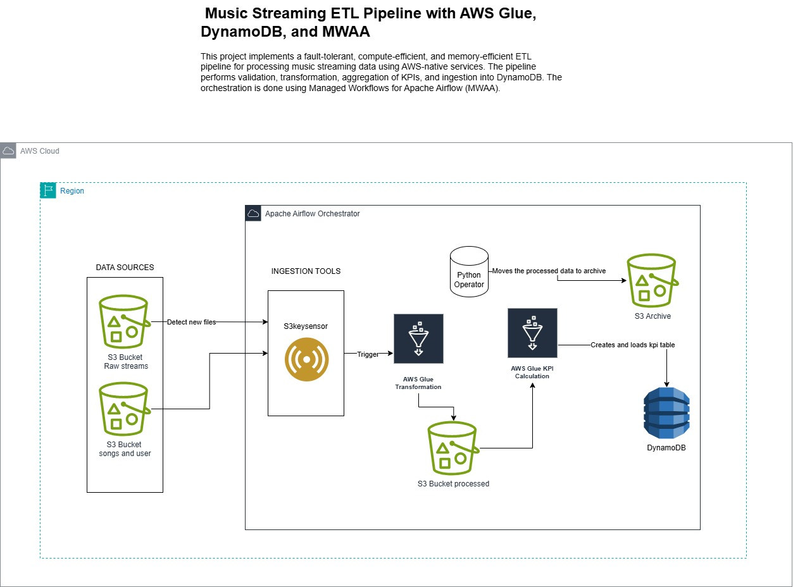
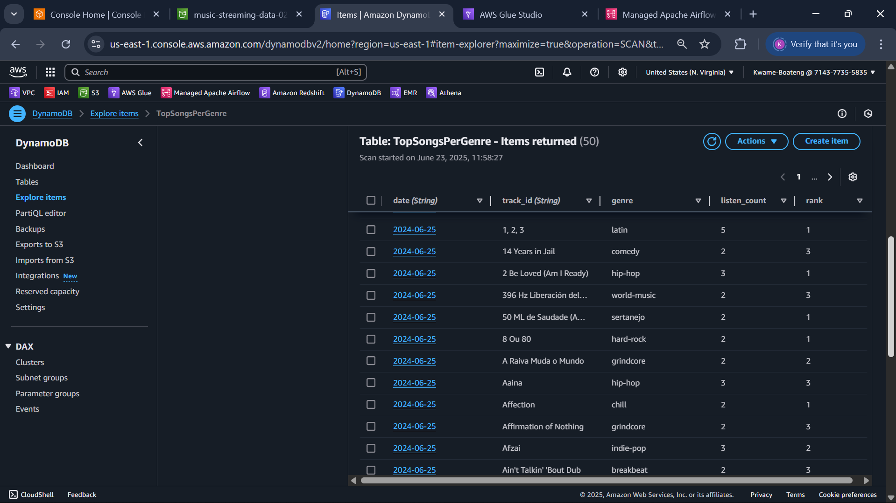
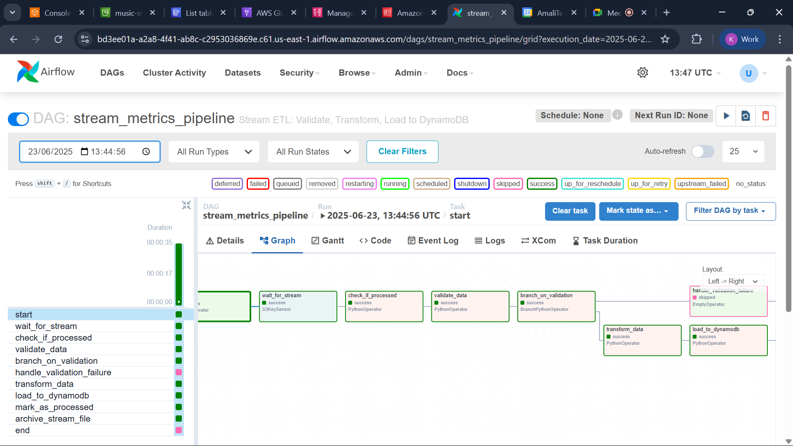

# Music Streaming ETL Pipeline with AWS Glue, DynamoDB, and MWAA

## Overview

This project implements a **fault-tolerant**, **compute-efficient**, and **memory-efficient** ETL pipeline for processing music streaming data using AWS-native services. The pipeline validates, transforms, and aggregates key performance indicators (KPIs) before ingesting the data into DynamoDB. Orchestration is managed using **Managed Workflows for Apache Airflow (MWAA)**.

---



---

## S3 Folder Structure

```
s3://music-streaming-data-02/
├── raw/
│   ├── users/users.csv
│   ├── songs/songs.csv
│   └── streams/
│       ├── streams1.csv
│       ├── streams2.csv
│       └── ...
├── validated/
│   ├── users/
│   ├── songs/
│   └── streams/
├── bad-records/
│   ├── users/
│   ├── songs/
│   └── streams/
├── processed/
│   ├── avg_metrics/
│   ├── top_songs/
│   └── top_genres/
```

---

## Components and Responsibilities

### 1. Validation (Glue Python Shell Job)

**Script:** `validate.py`

- Loads raw data from S3.
- Validates the presence of required columns.
- Removes rows with missing required values.
- Writes cleaned data to the `validated/` folder.
- Logs invalid records to the `bad-records/` folder for auditing.

---

### 2. Transformation and Aggregation (Glue Spark Job)

**Script:** `transform.py`

- Loads validated stream and song metadata.
- Joins datasets on `track_id`.
- Extracts `listen_date` from the timestamp.
- Computes:
  - Average listening time per user per genre/date.
  - Top 3 songs per genre per date.
  - Top 5 genres per date.
- Saves results as partitioned Parquet files under `processed/`.

---

### 3. DynamoDB Loader (Glue Python Shell Job)

**Script:** `load_dynamo.py`

- Reads Parquet files from the `processed/` directory.
- Creates DynamoDB tables if they don't already exist:
  - `DailyGenreKPIs`
  - `TopSongsPerGenre`
  - `ProcessedStreams`
- Uploads data using `boto3` and `batch_writer()`.
- Handles both partitioned and non-partitioned files.
- Skips and logs invalid rows.

---

## DynamoDB Table Definitions

### `DailyGenreKPIs`

- **Partition key:** `date` (String)  
- **Sort key:** `genre` (String)  
- **Attributes:**
  - `listen_count` (Number)
  - `unique_listeners` (Number)
  - `total_listening_time` (Number)
  - `avg_listening_time` (Number)

---

### `TopSongsPerGenre`

- **Partition key:** `date` (String)  
- **Sort key:** `genre` (String)  
- **Attributes:**
  - `track_id` (String)
  - `play_count` (Number)
  - `rank` (Number)



---

### `ProcessedStreams` (Tracking Table)

This table ensures **idempotency** and avoids reprocessing of stream files. It tracks every successfully processed file.

- **Partition key:** `filename` (String)  
- **Attributes:**
  - `processed_on` (String) — ISO timestamp of successful processing  
  - `status` (String) — E.g., `"success"` or `"failed"`

#### Create Table Script

```python
import boto3

dynamodb = boto3.client('dynamodb')

dynamodb.create_table(
    TableName='ProcessedStreams',
    KeySchema=[{'AttributeName': 'filename', 'KeyType': 'HASH'}],
    AttributeDefinitions=[{'AttributeName': 'filename', 'AttributeType': 'S'}],
    BillingMode='PAY_PER_REQUEST'
)
```

> This table is used by MWAA's `check_if_processed` and `mark_as_processed` tasks.

---

## Airflow DAG: `music_etl_pipeline.py`

- Uses `S3KeySensor` to detect new stream files.
- Prevents reprocessing of already handled files using the `ProcessedStreams` table.
- Triggers Glue validation jobs for users, songs, and stream data.
- Based on validation results, proceeds to transformation and loading steps.
- Updates the tracking table and archives processed files.

### Tasks

- `wait_for_stream` – Monitors for new CSVs in `raw/streams/`.
- `check_if_processed` – Skips previously processed files.
- `validate_*` – Runs validation jobs for each dataset.
- `transform_data` – Executes the aggregation job.
- `load_to_dynamodb` – Loads results into DynamoDB.
- `mark_as_processed` – Logs successful processing.
- `archive_stream_file` – Moves file to the archive location.



---

## Permissions

### IAM Role Requirements

Ensure your Glue and MWAA execution roles have these permissions:

- `s3:GetObject`, `s3:PutObject`, `s3:ListBucket`
- `dynamodb:PutItem`, `dynamodb:UpdateItem`, `dynamodb:DescribeTable`, `dynamodb:CreateTable`
- `glue:StartJobRun`, `glue:GetJobRun`

### Example Trust Policy for MWAA Role

```json
{
  "Version": "2012-10-17",
  "Statement": [
    {
      "Effect": "Allow",
      "Principal": {
        "Service": "airflow-env.amazonaws.com"
      },
      "Action": "sts:AssumeRole"
    }
  ]
}
```

---

## Notes and Best Practices

- Use `.dropna()` only on required columns to retain rows with optional fields.
- Partition by `"date"` for efficient querying with Athena or Redshift Spectrum.
- Column names are case-sensitive in Glue—validate exactly.
- Catch and handle `ResourceInUseException` when creating DynamoDB tables.
- Always archive processed files to avoid duplicates.

---

## Future Enhancements

- Implement data quality scoring (e.g., null percentage).
- Integrate SNS notifications for validation failures.
- Automate Glue Data Catalog schema updates.
- Add Athena or Redshift Spectrum query integration for downstream analytics.

---

## Conclusion

This end-to-end ETL pipeline demonstrates how to leverage AWS Glue, DynamoDB, and MWAA to process streaming music data with a focus on scalability, automation, and fault tolerance. The architecture supports efficient KPI generation and sets the stage for further analytical and business intelligence applications.
